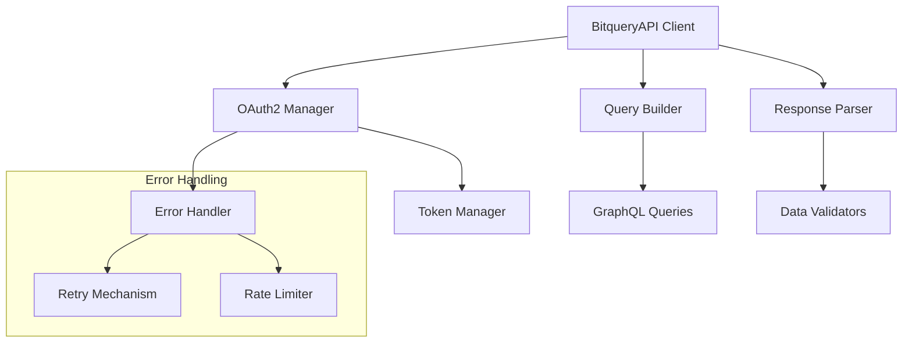
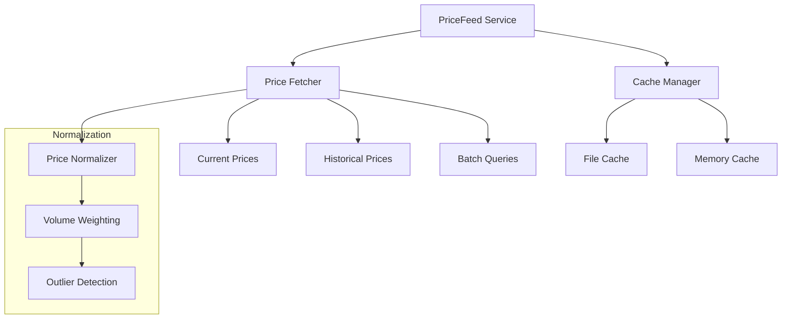
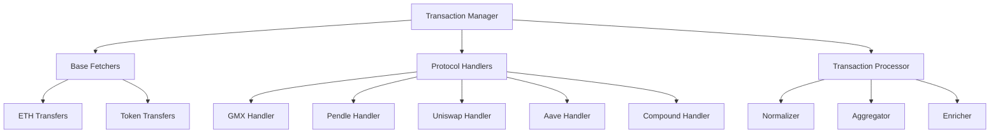
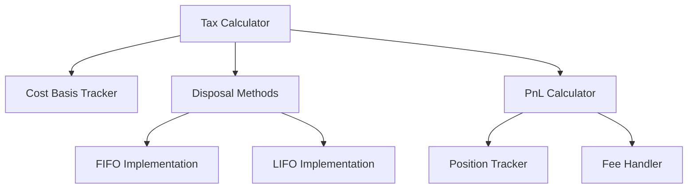
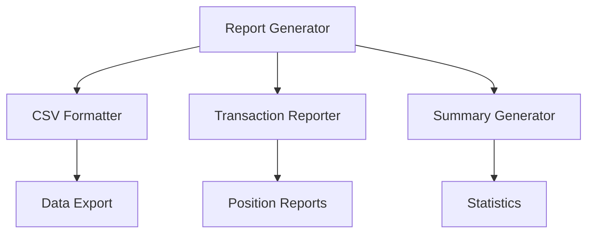
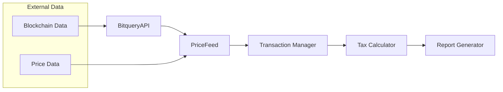

# TaxSeason v2 Component Map

## Core Infrastructure

### BitqueryAPI Module

### PriceFeed Module

## Transaction Processing

### Transaction Manager

## Tax Calculation Engine

### Core Calculator

## Report Generation

### Report Engine

## Data Flow Overview

## Component Dependencies

### Core Dependencies
- BitqueryAPI Module
  - OAuth2 Client
  - GraphQL Client
  - Rate Limiting
  - Error Handling

### Processing Dependencies
- Transaction Manager
  - Protocol-specific Handlers
  - Transfer Trackers
  - Position Managers

### Calculation Dependencies
- Tax Calculator
  - Cost Basis Engine
  - PnL Calculator
  - Fee Handler

### Output Dependencies
- Report Generator
  - Data Formatters
  - Export Handlers
  - Summary Generators

## Testing Components

### Test Structure
- Unit Tests
  - Component-level Testing
  - Mock Data Handlers
  - Validation Suites
- Integration Tests
  - Cross-module Testing
  - Protocol Integration
  - Data Flow Validation
- End-to-end Tests
  - Complete Workflow
  - Real Data Processing
  - Performance Metrics
