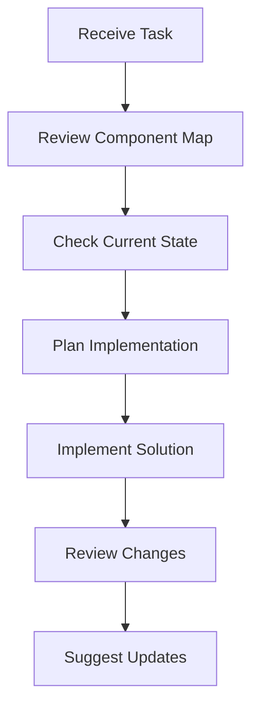

# AI Assistant Workflow

## Required Context
Before proceeding with any task, ensure you have read and understood the following files in order:
1. This workflow document (`workflow.md`)
2. Component map (`component_map.md`)
3. Current state (`current_state.md`)
4. Additional context as needed:
   - Development roadmap (`dev_roadmap.md`)
   - Directory structure (`dStructure.md`)

## Overview
This document outlines the systematic approach for handling development tasks in the TaxSeason v2 project. The workflow ensures consistency, maintains architectural integrity, and aligns with the project's current state and goals.

## Workflow Steps

### 1. Initial Assessment
1. Review the user's request
2. Identify which components are involved
3. Determine the scope of the change
4. Check if this is a new feature or modification

### 2. Component Map Analysis 🗺️
1. Check `component_map.md` to:
   - Identify affected components
   - Review component relationships
   - Understand dependencies
   - Verify architectural constraints
   - Ensure changes align with system design

2. Key Questions:
   - Which components will be modified?
   - Are there dependent components to consider?
   - Does this change affect the component hierarchy?
   - Are there interface changes needed?

### 3. Current State Evaluation 📊
1. Review `current_state.md` to:
   - Verify component status
   - Check current sprint goals
   - Review known issues
   - Identify technical debt impact
   - Confirm documentation status

2. Key Questions:
   - Is this aligned with current sprint goals?
   - Does this address any known issues?
   - Will this affect in-progress work?
   - Are there dependencies that need to be completed first?

### 4. Implementation Planning 📝
1. Based on gathered information:
   - Outline implementation approach
   - Identify potential risks
   - Consider testing requirements
   - Plan documentation updates

2. Consider:
   - Current component completion status
   - Existing technical debt
   - Performance implications
   - Testing coverage needs

### 5. Code Implementation 👨‍💻
1. Follow implementation best practices:
   - Maintain architectural patterns
   - Follow existing code style
   - Include necessary tests
   - Update documentation
   - Add appropriate error handling

2. Implementation Checklist:
   - [ ] Verify component boundaries
   - [ ] Check dependency requirements
   - [ ] Include necessary imports
   - [ ] Add error handling
   - [ ] Include tests
   - [ ] Update documentation

### 6. Post-Implementation Review 🔍
1. Verify:
   - Code aligns with architecture
   - All dependencies are handled
   - Tests are included
   - Documentation is updated
   - No new technical debt introduced

## Example Workflow



## Response Template

```markdown
### Task Analysis
- Components Involved: [List from component_map.md]
- Current Status: [From current_state.md]
- Dependencies: [List any dependencies]

### Implementation Approach
- Proposed Changes: [Description]
- Affected Components: [List]
- Testing Requirements: [List]

### Code Suggestions
[Code implementation details]

### Post-Implementation
- Documentation Updates: [List needed updates]
- Test Coverage: [New tests needed]
- Future Considerations: [Any technical debt or future work]
```

## Best Practices

### Do's ✅
1. Always check component map first
2. Verify current state before suggesting changes
3. Consider existing technical debt
4. Maintain architectural boundaries
5. Include testing requirements
6. Update documentation
7. Consider performance implications

### Don'ts ❌
1. Skip architecture review
2. Ignore current state
3. Break component boundaries
4. Introduce unnecessary dependencies
5. Create new technical debt
6. Bypass error handling
7. Leave documentation outdated

## Special Considerations

### New Features
1. Check if it fits current architecture
2. Review impact on existing components
3. Consider scalability implications
4. Plan for testing coverage

### Bug Fixes
1. Verify root cause against architecture
2. Check impact on other components
3. Consider regression testing
4. Update related documentation

### Refactoring
1. Ensure architectural alignment
2. Review technical debt impact
3. Consider testing implications
4. Update component documentation

## Maintaining Documentation
1. Update component map if needed
2. Reflect changes in current state
3. Update technical documentation
4. Keep workflow document current

Remember: The goal is to maintain system integrity while delivering effective solutions that align with the project's architecture and current state. 